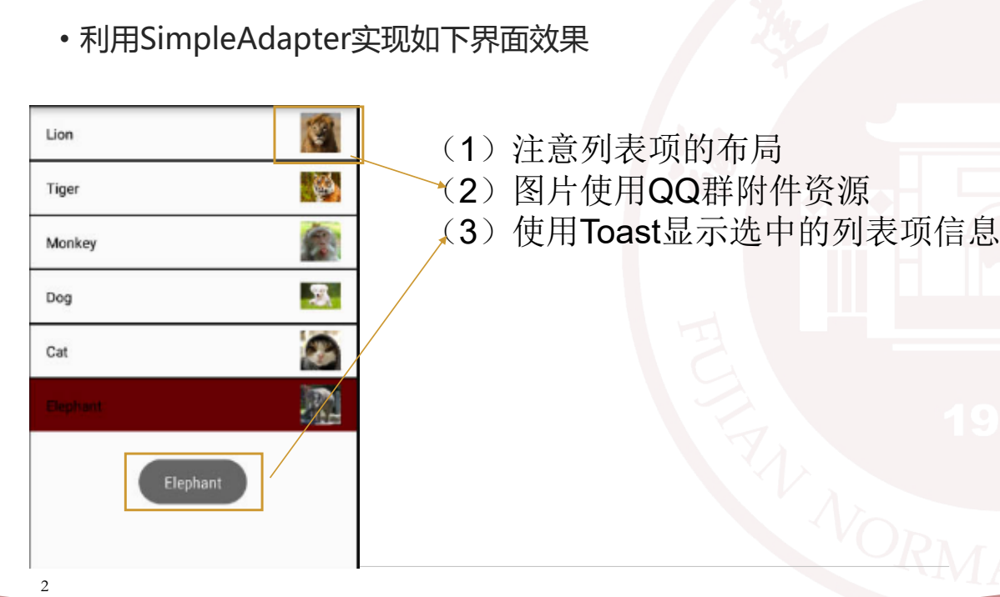
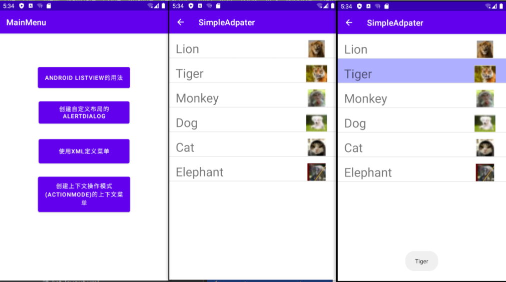
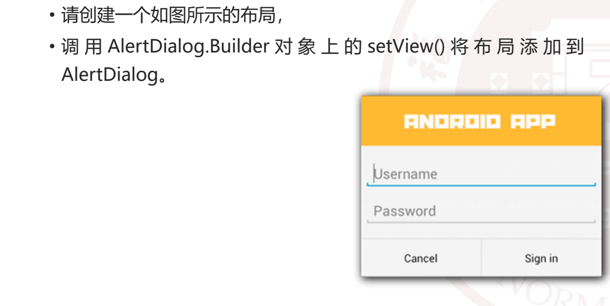
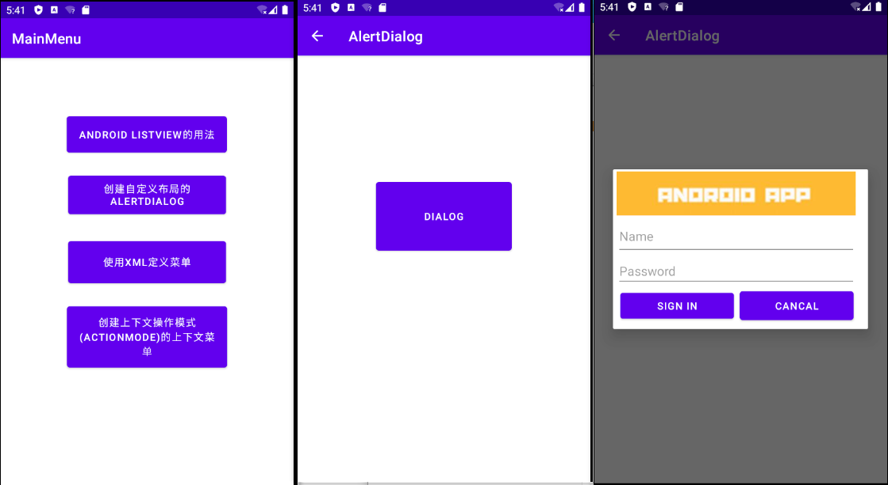
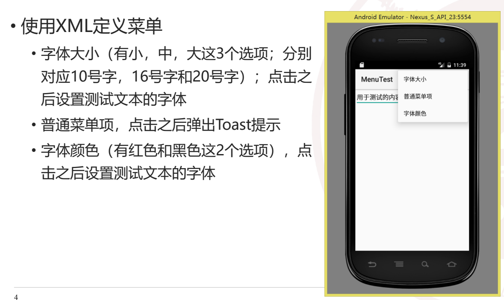
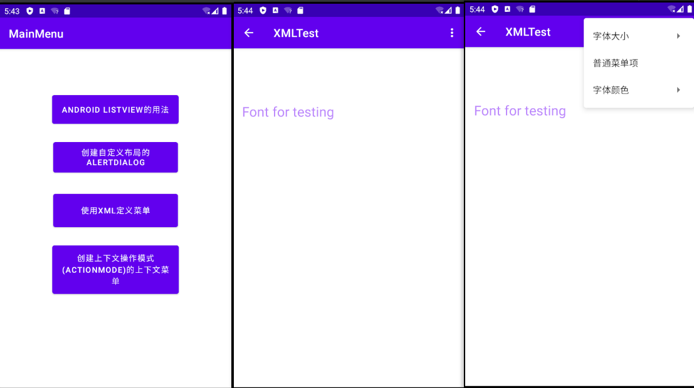
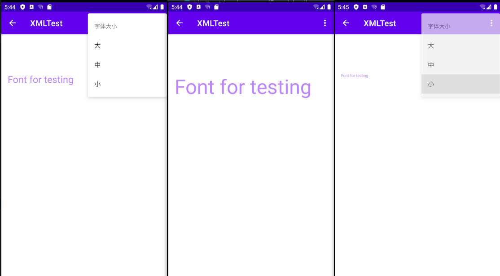
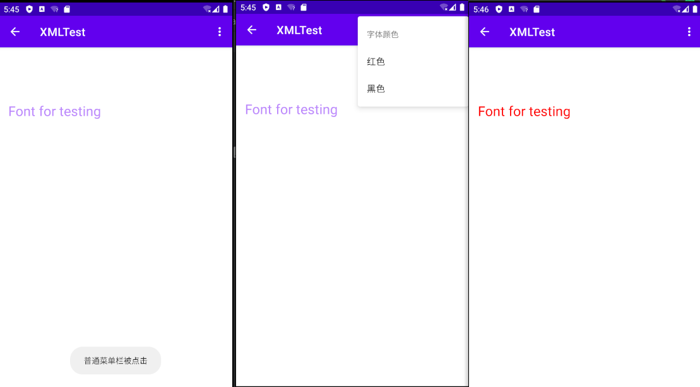
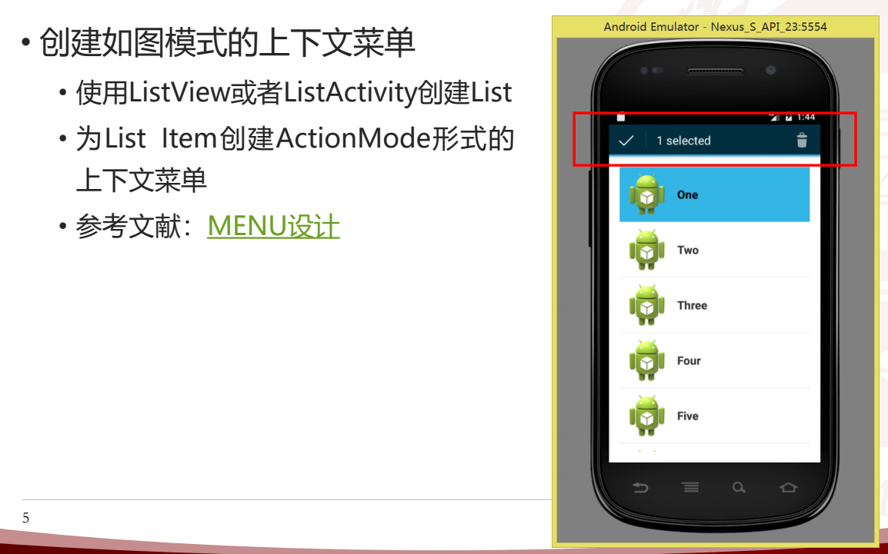
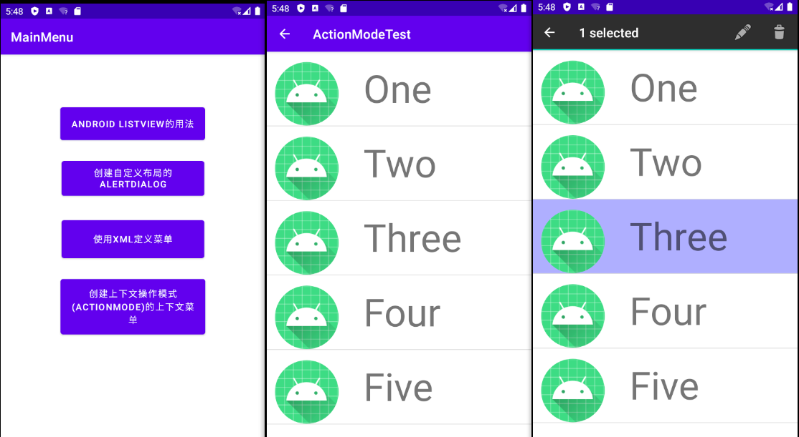

# 实验3_Android界面组件

## 1.Android ListView的用法

• 利用SimpleAdapter实现如下界面效果



#### 关键代码

java代码

```java
public class ListTestView extends AppCompatActivity {
	private List<Map<String,Object>> lists;
    private SimpleAdapter adapter;
    private ListView listView;

    //    定义数据
    private String[] theme = {"Lion", "Tiger", "Monkey", "Dog", "Cat", "Elephant"};
    private int[] imageViews = {R.drawable.lion, R.drawable.tiger, R.drawable.monkey, R.drawable.dog, R.drawable.cat, R.drawable.elephant};

    @Override
    protected void onCreate(Bundle savedInstanceState) {
        super.onCreate(savedInstanceState);
        setContentView(R.layout.activity_listtest);
        setTitle("SimpleAdpater");
        listView = (ListView) findViewById(R.id.list_view);
        // 数据源
        lists = new ArrayList<>();
        for(int i = 0; i<theme.length; i++){
            Map<String, Object>map = new HashMap<>();
            map.put("image", imageViews[i]);
            map.put("theme", theme[i]);
            lists.add(map);
        }

        adapter = new SimpleAdapter(ListTestView.this, lists,
                R.layout.list_layout, new String[]{"image", "theme"},
                new int[]{R.id.image, R.id.text});
        listView.setAdapter(adapter);

        listView.setOnItemClickListener(new AdapterView.OnItemClickListener() {
            @Override
            public void onItemClick(AdapterView<?> parent, View view, int position, long id) {
                Toast toast = Toast.makeText(ListTestView.this, theme[position],Toast.LENGTH_SHORT);
                toast.show();
            }
        });
    }
}
```

xml代码

```xml
<?xml version="1.0" encoding="utf-8"?>
<androidx.constraintlayout.widget.ConstraintLayout xmlns:android="http://schemas.android.com/apk/res/android"
    xmlns:app="http://schemas.android.com/apk/res-auto"
    xmlns:tools="http://schemas.android.com/tools"
    android:layout_width="match_parent"
    android:layout_height="match_parent"
    tools:context=".MainActivity">

    <ListView
        android:id="@+id/list_view"
        android:layout_width="match_parent"
        android:layout_height="match_parent"
        android:layout_marginBottom="60dp"
        android:listSelector="#500000FF"
        app:layout_constraintBottom_toBottomOf="parent"></ListView>


</androidx.constraintlayout.widget.ConstraintLayout>
```

```xml
<?xml version="1.0" encoding="utf-8"?>
<androidx.constraintlayout.widget.ConstraintLayout xmlns:android="http://schemas.android.com/apk/res/android"
    xmlns:app="http://schemas.android.com/apk/res-auto"
    xmlns:tools="http://schemas.android.com/tools"
    android:layout_width="match_parent"
    android:layout_height="match_parent"
    android:orientation="horizontal">

    <ImageView
        android:id="@+id/image"
        android:layout_width="71dp"
        android:layout_height="43dp"
        android:layout_marginTop="16dp"
        android:layout_marginEnd="16dp"
        android:src="@mipmap/ic_launcher"
        app:layout_constraintEnd_toEndOf="parent"
        app:layout_constraintTop_toTopOf="parent" />

    <TextView
        android:id="@+id/text"
        android:layout_width="wrap_content"
        android:layout_height="43dp"
        android:layout_marginStart="16dp"
        android:layout_marginTop="16dp"
        android:text="Text"
        android:textSize="30sp"
        app:layout_constraintStart_toStartOf="parent"
        app:layout_constraintTop_toTopOf="parent" />


</androidx.constraintlayout.widget.ConstraintLayout>
```

#### 结果截图



## 2.创建自定义布局的AlertDialog



#### 关键代码

java代码

```java
public class AlertdialogView extends AppCompatActivity {
    @Override
    protected void onCreate(Bundle savedInstanceState) {
        super.onCreate(savedInstanceState);
        setContentView(R.layout.activity_alertdialog);
        setTitle("AlertDialog");
        Button button = (Button) findViewById(R.id.alertbtn);
        button.setOnClickListener(new Button.OnClickListener(){
            @Override
            public void onClick(View v) {
                AlertDialog.Builder builder = new AlertDialog.Builder(AlertdialogView.this);
                final AlertDialog dialog = builder.create();
                View dialogView = View.inflate(AlertdialogView.this, R.layout.login, null);
                dialog.setView(dialogView);
                dialog.show();
            }
        });


    }

    public void showDialog(View view) {
        AlertDialog.Builder builder = new AlertDialog.Builder(AlertdialogView.this);
        final AlertDialog dialog = builder.create();
        View dialogView = View.inflate(AlertdialogView.this, R.layout.login, null);
        dialog.setView(dialogView);
        dialog.show();
    }
}

```

xml代码

```xml
<?xml version="1.0" encoding="utf-8"?>
<androidx.constraintlayout.widget.ConstraintLayout xmlns:android="http://schemas.android.com/apk/res/android"
    xmlns:app="http://schemas.android.com/apk/res-auto"
    xmlns:tools="http://schemas.android.com/tools"
    android:layout_width="match_parent"
    android:layout_height="match_parent"
    android:orientation="vertical">

    <LinearLayout
        android:layout_width="346dp"
        android:layout_height="225dp"
        android:orientation="vertical"
        android:paddingLeft="5dp"
        android:paddingRight="5dp"
        app:layout_constraintBottom_toBottomOf="parent"
        app:layout_constraintEnd_toEndOf="parent"
        app:layout_constraintHorizontal_bias="0.0"
        app:layout_constraintStart_toStartOf="parent"
        app:layout_constraintTop_toTopOf="parent"
        app:layout_constraintVertical_bias="0.023">

        <ImageView
            android:id="@+id/imageView"
            android:layout_width="336dp"
            android:layout_height="68dp"
            app:srcCompat="@drawable/title" />

        <EditText
            android:id="@+id/editTextTextPersonName"
            android:layout_width="336dp"
            android:layout_height="53dp"
            android:ems="10"
            android:hint="Name"
            android:inputType="textPersonName"
            app:layout_constraintBottom_toBottomOf="parent"
            app:layout_constraintEnd_toEndOf="parent"
            app:layout_constraintHorizontal_bias="0.488"
            app:layout_constraintStart_toStartOf="parent"
            app:layout_constraintTop_toTopOf="parent"
            app:layout_constraintVertical_bias="0.461" />


        <EditText
            android:id="@+id/editTextTextPassword"
            android:layout_width="336dp"
            android:layout_height="wrap_content"
            android:ems="10"
            android:hint="Password"
            android:inputType="textPassword"
            app:layout_constraintEnd_toEndOf="parent"
            app:layout_constraintStart_toStartOf="parent"
            app:layout_constraintTop_toBottomOf="@+id/editTextTextPersonName" />

        <LinearLayout
            android:layout_width="396dp"
            android:layout_height="213dp"
            android:orientation="horizontal"
            android:paddingLeft="5dp"
            android:paddingRight="5dp"
            app:layout_constraintBottom_toBottomOf="parent"
            app:layout_constraintEnd_toEndOf="parent"
            app:layout_constraintHorizontal_bias="0.0"
            app:layout_constraintStart_toStartOf="parent"
            app:layout_constraintTop_toTopOf="parent"
            app:layout_constraintVertical_bias="0.023">

            <Button
                android:id="@+id/button4"
                android:layout_width="160dp"
                android:layout_height="wrap_content"
                android:layout_marginBottom="5dp"
                android:text="Sign In"
                app:layout_constraintBottom_toBottomOf="parent"
                app:layout_constraintEnd_toEndOf="parent"
                app:layout_constraintHorizontal_bias="0.958"
                app:layout_constraintStart_toEndOf="@+id/button3" />

            <Button
                android:id="@+id/button3"
                android:layout_width="160dp"
                android:layout_height="52dp"
                android:layout_marginStart="8dp"
                android:layout_marginBottom="5dp"
                android:text="Cancal"
                app:layout_constraintBottom_toBottomOf="parent"
                app:layout_constraintStart_toStartOf="parent" />
        </LinearLayout>
    </LinearLayout>


</androidx.constraintlayout.widget.ConstraintLayout>
```

#### 结果截图



## 3.使用XML定义菜单



#### 关键代码

java代码

```java
public class XmlfontView extends AppCompatActivity {
    @Override
    protected void onCreate(Bundle savedInstanceState) {
        super.onCreate(savedInstanceState);
        setContentView(R.layout.activity_xmltest);
        setTitle("XMLTest");
    }

    //调用菜单资源
    @Override
    public boolean onCreateOptionsMenu(Menu menu) {
        MenuInflater inflater = getMenuInflater();
        inflater.inflate(R.menu.my_menu, menu);
        return true;
    }

    //菜单点击事件
    @Override
    public boolean onOptionsItemSelected(MenuItem item) {
        super.onOptionsItemSelected(item);
        TextView testview = (TextView) findViewById(R.id.textView);
        switch (item.getItemId()) {
            case R.id.bigitem:
                testview.setTextSize(TypedValue.COMPLEX_UNIT_SP , 50);
                break;
            case R.id.middleitem:
                testview.setTextSize(TypedValue.COMPLEX_UNIT_SP , 30);
                break;
            case R.id.smallitem:
                testview.setTextSize(TypedValue.COMPLEX_UNIT_SP , 10);
                break;
            case R.id.item2:
                Toast.makeText(this, "普通菜单栏被点击", Toast.LENGTH_SHORT).show();
                break;
            case R.id.red:
                testview.setTextColor(Color.rgb(255, 0, 0));
                break;
            case R.id.black:
                testview.setTextColor(Color.rgb(0, 0, 0));
                break;
        }
        return true;
    }
}
```

xml代码

```xml
<?xml version="1.0" encoding="utf-8"?>
<androidx.constraintlayout.widget.ConstraintLayout xmlns:android="http://schemas.android.com/apk/res/android"
    xmlns:app="http://schemas.android.com/apk/res-auto"
    xmlns:tools="http://schemas.android.com/tools"
    android:layout_width="match_parent"
    android:layout_height="match_parent">

    <TextView
        android:id="@+id/textView"
        android:layout_width="392dp"
        android:layout_height="102dp"
        android:layout_marginStart="16dp"
        android:layout_marginTop="96dp"
        android:text="Font for testing"
        android:textColor="@color/purple_200"
        android:textSize="24sp"
        app:layout_constraintStart_toStartOf="parent"
        app:layout_constraintTop_toTopOf="parent" />
</androidx.constraintlayout.widget.ConstraintLayout>
```

```xml
<?xml version="1.0" encoding="utf-8"?>
<menu xmlns:android="http://schemas.android.com/apk/res/android">

    <item
        android:id="@+id/item1"
        android:icon="@mipmap/ic_launcher"
        android:title="字体大小">
        <menu>
            <item
                android:id="@+id/bigitem"
                android:title="大"/>
            <item
                android:id="@+id/middleitem"
                android:title="中"/>
            <item
                android:id="@+id/smallitem"
                android:title="小"/>
        </menu>
    </item>
    <item
        android:id="@+id/item2"
        android:icon="@mipmap/ic_launcher"
        android:title="普通菜单项"/>

    <item
        android:id="@+id/item3"
        android:icon="@mipmap/ic_launcher"
        android:title="字体颜色">
        <menu>
            <item
                android:id="@+id/red"
                android:title="红色"/>
            <item
                android:id="@+id/black"
                android:title="黑色"/>
        </menu>
    </item>

</menu>
```

#### 结果截图







## 4.创建上下文操作模式(ActionMode)的上下文菜单



#### 关键代码

!!**多选全部颜色高亮未完成**

```java
public class ActionModeView extends AppCompatActivity {

    //    这三个经常是同时出现的
    private List<Map<String,Object>> lists;
    private SimpleAdapter adapter;
    private ListView listView;

    //    定义数据
    private String[] theme = {"One", "Two", "Three", "Four", "Five"};
    private int[] imageViews = {R.mipmap.ic_launcher, R.mipmap.ic_launcher,
            R.mipmap.ic_launcher, R.mipmap.ic_launcher, R.mipmap.ic_launcher};


    @Override
    protected void onCreate(Bundle savedInstanceState) {
        super.onCreate(savedInstanceState);
        setContentView(R.layout.activity_actionmode);
        setTitle("ActionModeTest");
        listView = (ListView) findViewById(R.id.list_view);
        // 数据源
        lists = new ArrayList<>();
        for(int i = 0; i<theme.length; i++){
            Map<String, Object> map = new HashMap<>();
            map.put("image", imageViews[i]);
            map.put("theme", theme[i]);
            lists.add(map);
        }

        adapter = new SimpleAdapter(ActionModeView.this, lists,
                R.layout.list_big_layout, new String[]{"image", "theme"},
                new int[]{R.id.image, R.id.text});
        listView.setAdapter(adapter);

        listView.setChoiceMode(ListView.CHOICE_MODE_MULTIPLE_MODAL);

        listView.setMultiChoiceModeListener(new ListView.MultiChoiceModeListener() {
            @Override
            /*
             * 参数：ActionMode是长按后出现的标题栏
             * 		positon是当前选中的item的序号
             *		id 是当前选中的item的id
             *		checked 如果是选中事件则为true，如果是取消事件则为false
             */
            public void onItemCheckedStateChanged(ActionMode mode, int position, long id, boolean checked) {
                mode.setTitle(listView.getCheckedItemCount()+" selected");
                if(checked == true)
                {
                    System.out.println(adapter.getItem(position));
                }
                else{

                }
            }

            @Override
            public boolean onCreateActionMode(ActionMode mode, Menu menu) {
                mode.getMenuInflater().inflate(R.menu.action_menu,menu);
                return true;
            }

            @Override
            public boolean onPrepareActionMode(ActionMode mode, Menu menu) {
                return false;
            }

            @Override
            public boolean onActionItemClicked(ActionMode mode, MenuItem item) {
                return false;
            }

            @Override
            public void onDestroyActionMode(ActionMode mode) {
            }
        });
    }
}
```

xml文件

```xml
<?xml version="1.0" encoding="utf-8"?>
<androidx.constraintlayout.widget.ConstraintLayout xmlns:android="http://schemas.android.com/apk/res/android"
    xmlns:app="http://schemas.android.com/apk/res-auto"
    xmlns:tools="http://schemas.android.com/tools"
    android:layout_width="match_parent"
    android:layout_height="match_parent"
    tools:context=".ActionModeView">

    <ListView
        android:id="@+id/list_view"
        android:layout_width="match_parent"
        android:layout_height="match_parent"
        android:listSelector="#500000FF"
        app:layout_constraintBottom_toBottomOf="parent"></ListView>


</androidx.constraintlayout.widget.ConstraintLayout>
```

```xml
<?xml version="1.0" encoding="utf-8"?>
<androidx.constraintlayout.widget.ConstraintLayout xmlns:android="http://schemas.android.com/apk/res/android"
    xmlns:app="http://schemas.android.com/apk/res-auto"
    xmlns:tools="http://schemas.android.com/tools"
    android:layout_width="match_parent"
    android:layout_height="match_parent">

    <ImageView
        android:id="@+id/image"
        android:layout_width="125dp"
        android:layout_height="99dp"
        android:layout_marginTop="16dp"
        android:src="@mipmap/ic_launcher"
        app:layout_constraintEnd_toEndOf="parent"
        app:layout_constraintHorizontal_bias="0.0"
        app:layout_constraintStart_toStartOf="parent"
        app:layout_constraintTop_toTopOf="parent" />

    <TextView
        android:id="@+id/text"
        android:layout_width="250dp"
        android:layout_height="97dp"
        android:layout_marginTop="16dp"
        android:text="Text"
        android:textSize="60sp"
        app:layout_constraintEnd_toEndOf="parent"
        app:layout_constraintHorizontal_bias="0.7"
        app:layout_constraintStart_toEndOf="@+id/image"
        app:layout_constraintTop_toTopOf="parent" />

</androidx.constraintlayout.widget.ConstraintLayout>
```

```xml
<?xml version="1.0" encoding="utf-8"?>
<menu xmlns:android="http://schemas.android.com/apk/res/android">
    <item android:id="@+id/edit"
        android:icon="@android:drawable/ic_menu_edit"
        android:title=""/>

    <item android:id="@+id/delete"
        android:icon="@android:drawable/ic_menu_delete"
        android:title=""/>

</menu>
```

#### 结果截图


